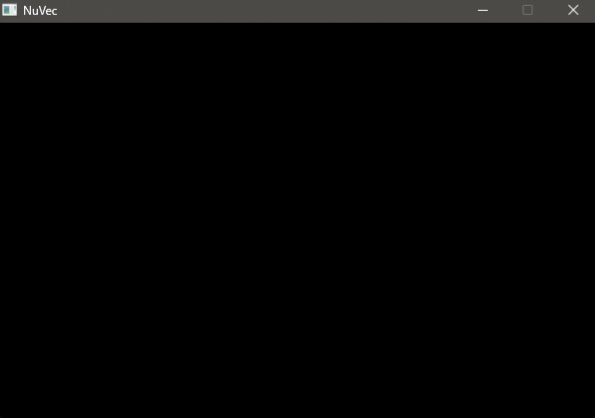

```
▄▄▄    ▄▄▄       ▄▄▄▄  ▄▄▄▄  ▄▄▄▄▄▄▄  ▄▄▄▄▄▄▄
████▄  ███       ▀███  ███▀ ███▀▀▀▀▀ ███▀▀▀▀▀
███▀██▄███ ██ ██  ███  ███  ███▄▄    ███
███  ▀████ ██ ██  ███▄▄███  ███      ███
███    ███ ▀██▀█   ▀████▀   ▀███████ ▀███████
```

A from-scratch Vectrex emulator written in C, featuring a Motorola 6809 CPU core, 6522 VIA emulation and a cycle-driven analogue vector display model.

> **NuVec is under active development.** It currently boots the original Vectrex BIOS and runs tested commercial cartridges through gameplay. Sound, controller input and a loading interface are still in progress.



## Overview

NuVec emulates the core hardware of the Vectrex console rather than translating game drawing routines into conventional graphics calls.

The vector display is generated from the emulated VIA, DAC, sample-and-hold circuits, multiplexer and analogue integrators. This allows graphics and text to emerge from the same signal path used by the original hardware.

The project currently runs:

* **Space Wars (1982)**
* **Star Hawk (1982)**

Both have been tested from BIOS startup through live gameplay.

## Current status

### Working

* Cartridge ROM loading from file
* Vectrex memory map, including RAM, BIOS ROM and cartridge ROM
* Motorola 6809 fetch-decode-execute core
* Documented addressing modes, including indexed-addressing submodes
* Arithmetic, branches, stack operations and condition-code handling
* Subroutine flow through `JSR` and `RTS`
* Interrupt handling, including `CWAI` and IRQ delivery
* Register-level 6522 VIA emulation
* Per-cycle DAC, multiplexer, sample-and-hold, ramp and blanking behaviour
* Analogue integrator model for vector and text rendering
* CPU and frame-rate throttling approximating the original 1.5 MHz and 50 Hz hardware timing
* SDL2 rendering
* Correct Vectrex BIOS startup display

### Not yet implemented

* AY-3-8912 sound emulation
* Controller input
* BIOS and ROM selection interface
* Drag-and-drop ROM loading
* Packaged standalone releases

## Building

NuVec currently builds with:

* CMake
* MinGW-w64 (via a portable toolchain or MSYS2's ucrt64 environment)
* SDL2

```bash
cmake -S . -B build -G Ninja
cmake --build build
```

The generator depends on your toolchain — `Ninja` above assumes MSYS2's ucrt64 (`ninja.exe` included). If you're using a plain MinGW-w64 install without Ninja, use `-G "MinGW Makefiles"` instead.

## Usage

Run NuVec with a cartridge ROM path:

```bash
NuVec.exe path\to\game.vec
```

The BIOS path is currently hardcoded in `main.c` (set the `BIOS_PATH` constant to point at your own Vectrex BIOS dump before building). A proper BIOS and ROM loading interface is planned.

## Architecture

```text
Cartridge / BIOS
       │
       ▼
 Motorola 6809
       │
       ▼
   6522 VIA
       │
       ▼
 DAC / MUX / sample-and-hold
       │
       ▼
 Analogue integrator model
       │
       ▼
   SDL2 vector renderer
```

Unlike a high-level-emulation approach, NuVec does not replace BIOS drawing routines with hardcoded lines or text. The displayed vectors are produced from the state of the emulated hardware.

## Roadmap

* [x] Vectrex memory map
* [x] Motorola 6809 execution core
* [x] 6522 VIA emulation
* [x] Analogue vector display model
* [x] BIOS startup and text rendering
* [x] Commercial cartridges running through gameplay
* [ ] Automated CPU and hardware tests
* [ ] Controller input
* [ ] AY-3-8912 sound emulation
* [ ] BIOS and ROM loading interface
* [ ] Standalone release builds
* [ ] Original homebrew game and development tooling

## Project goals

NuVec is primarily an exploration of emulator development, embedded-style hardware behaviour and low-level systems programming.

Longer term, the project may also become a platform for developing and testing original Vectrex homebrew software.

## License

Licensed under the MIT License.

Vectrex, game ROMs and BIOS images are not included in this repository.

## Contributing

The project is still changing rapidly, so it is not yet organised around external contributions. Bug reports, technical discussion and issue submissions are welcome.

## References

- MOS Technology 6522 Versatile Interface Adapter datasheet
- Vectrex Programmer's Manual
- Vectrex hardware and vector-display documentation at playvectrex.com
